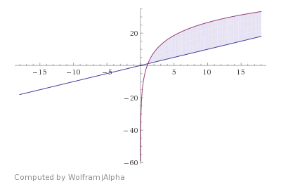
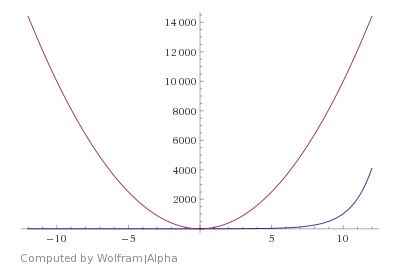

### Exercises 1.2-1
***
Give an example of an application that requires algorithmic content at the application
level, and discuss the function of the algorithms involved.

### `Answer`
When we use Map App like Google Map, we need to find the shortest way to travel from current location to the destination. Google Map would return the result by running its embedded routing algorithm to solve it.

### Exercises 1.2-2
***
Suppose we are comparing implementations of insertion sort and merge sort on the same machine. For inputs of size n, insertion sort runs in $8n^2$ steps, while merge sort runs in $64nlg{n}$ steps. For which values of n does insertion sort beat merge sort?

### `Answer`
To solve the inequality equation:
$8n^2<=64nlg{n}$
Check the image:  
  
$2<n<43$

### Exercises 1.2-3
***
What is the smallest value of n such that an algorithm whose running time is $100n^2$ runs faster
than an algorithm whose running time is $2^n$ on the same machine?

### `Answer`
To solve the inequality equation:
$2^n>100n^2$  
Check the image:  
  
$n>15$
