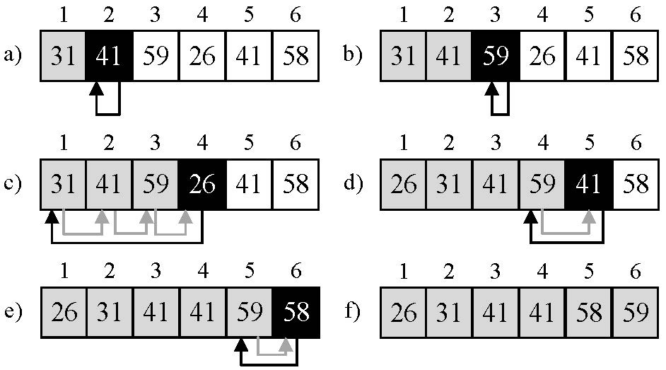
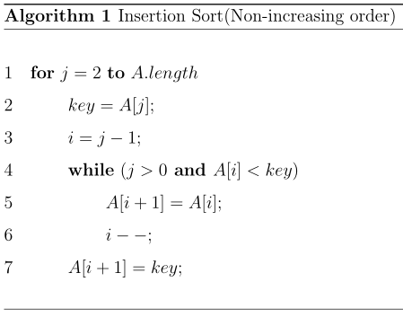
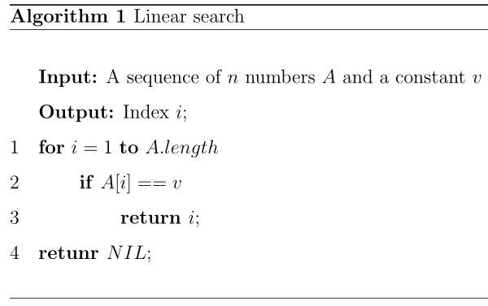
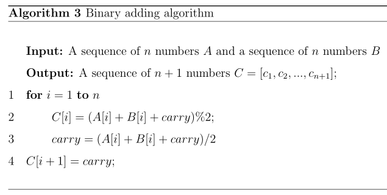

### Exercises 2.1-1
***
Using Figure 2.2 as a model, illustrate the operation of INSERTION-SORT on the array A = [31, 41, 59, 26, 41, 58].

### `Answer`

### Exercises 2.1-2
***
Rewrite the INSERTION-SORT procedure to sort into nonincreasing instead of nondecreasing order.

### `Answer`

### Exercises 2.1-3
***
Consider the searching problem:

* **Input**: A sequence of n numbers A = [a1, a2, . . . , an] and a value v.
* **Output**: An index i such that v = A[i] or the special value NIL if v does not appear in A.

Write pseudocode for **linear search**, which scans through the sequence, looking for v. Using a loop invariant, prove that your algorithm is correct. Make sure that your loop invariant fulfills the three necessary properties.

### `Answer`

### Exercises 2.1-4
***
Consider the problem of adding two n-bit binary integers, stored in two n-element arrays A and B. The sum of the two integers should be stored in binary form in an (n + 1)-element array C. State the problem formally and write pseudocode for adding the two integers.

### `Answer`
Binary adding problem:
* **Input**: A sequence of n numbers A = [a1, a2, . . . , an] and a sequence of n numbers B = [b1, b2, ..., bn].
* **Output**: A sequence of n+1 numbers C = [c1, c2, ..., cn].

