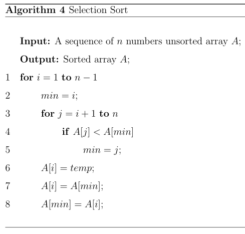

### Exercises 2.2-1
***
Express the function $n^3/1000 - 100n^2 - 100n+3$ in terms of $\Theta$-notation.

### `Answer`
$\Theta(n^3)$

### Exercises 2.2-2
***
Consider sorting n numbers stored in array A by first finding the smallest element of A and exchanging it with the element in A[1]. Then find the second smallest element of A, and exchange it with A[2]. Continue in this manner for the first n - 1 elements of A. Write pseudocode for this algorithm, which is known as **selection sort**. What loop invariant does this algorithm maintain? Why does it need to run for only the first n - 1 elements, rather than for all n elements? Give the best-case and worst-case running times of selection sort in $\Theta$-notation.

### `Answer`
  

**Loop invariant**: At the start of each iteration of the outer for loop, the subarray A[1..i-1] consists of the i-1 sorted elements in the array A[1..n].

The last elements of the array is the smallest after all n-1 is sorted.

Both For the best-case and worse case, it still takes n-1 steps to find the smallest element in A[1...i], thus the running time of them turn to be $\Theta(n^2)$

### Exercises 2.2-3
***
Consider linear search again (see Exercise 2.1-3). How many elements of the input sequence need to be checked on the average, assuming that the element being searched for is equally likely to be any element in the array? How about in the worst case? What are the average-case and worst-case running times of linear search in Θ-notation? Justify your answers.

### `Answer`
* Assuming equal probability of occurrence $1/n$ for the inputting sequence, average number of elements which need to be checked is
\[
  \frac{1}{n}(1 + 2 + ... +n) = \frac{n+1}{2}
\]
* the running time is $\Theta(n)$
* For the worst case, the element to search is dead last in the array. In that case $n$ elements need to be searched. Running time is $\Theta(n)$

Thus, all these cases are $\Theta(n)$

### Exercises 2.2-4
***
How can we modify almost any algorithm to have a good best-case running time?

### `Answer`
Checking the inputs of the algorithm to determine whether to output the pre-computed answers.
