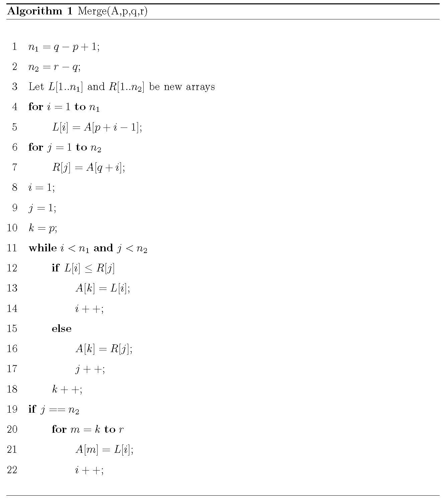
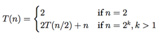
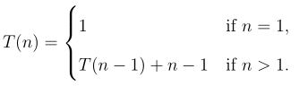
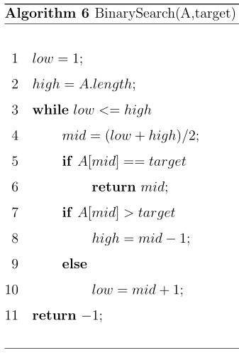

### Exercises 2.2-1
***
Using Figure 2.4 as a model, illustrate the operation of merge sort on the array A = <3, 41, 52, 26, 38, 57, 9, 49>.

### `Answer`

### Exercises 2.2-1
***
Rewrite the MERGE procedure so that it does not use sentinels, instead stopping
once either array L or R has had all its elements copied back to A and then copying
the remainder of the other array back into A.

### `Answer`
* Pseudo-code:

* Java-code:
[code](./MergeSort2.java)

### Exercises 2.3-3
***
Use mathematical induction to show that when n is an exact power of 2, the solution of the recurrence
 is $n\lg n$.

### `Answer`
* Assumption: $F(k)=T(2^k)$.
* When $k=1$, i.e. $n=2$, $F(1)=T(2)=2$.
* When $k>1$, assumes the recurrence is $n\lg n$, then $F(k)=2^k\lg 2^k$
\[
  F(k+1)=T(2^{k+1})=2T(2^k)+2^{k+1}=2*2^k\lg 2^k+2^{k+1}=2^{k+1}(\lg 2^k+1)=2^{k+1}\lg 2^{k+1} \\
\]

### Exercises 2.3-4
***
Insertion sort can be expressed as a recursive procedure as follows. In order to sort A[1..n], we recursively sort A[1..n -1] and then insert A[n] into the sorted array A[1..n - 1]. Write a recurrence for the running time of this recursive version of insertion sort.

### `Answer`

### Exercises 2.3-5
***
Referring back to the searching problem (see Exercise 2.1-3), observe that if the sequence A is sorted, we can check the midpoint of the sequence against v and eliminate half of the sequence from further consideration. **Binary search** is an algorithm that repeats this procedure, halving the size of the remaining portion of the sequence each time. Write pseudocode, either iterative or recursive, for binary search. Argue that the worst-case running time of binary search is $\Theta(\lg n)$.

### `Answer`
* Pseudo code

* Java code
[code](./BinarySort.java)
* Worst case analysis
For the worst case given an array with size of n, the target elements is the start or end of this array. Thus the running time $T(n)=\lg n + C$ 
