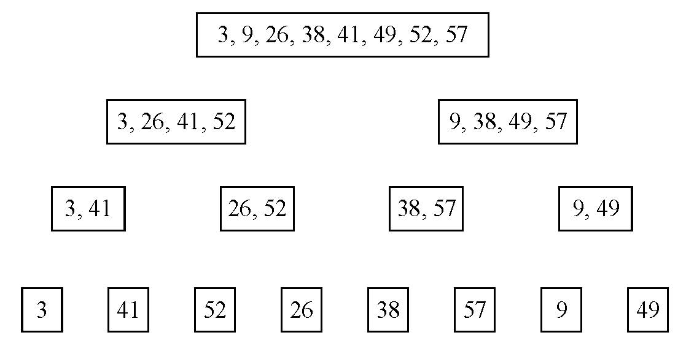
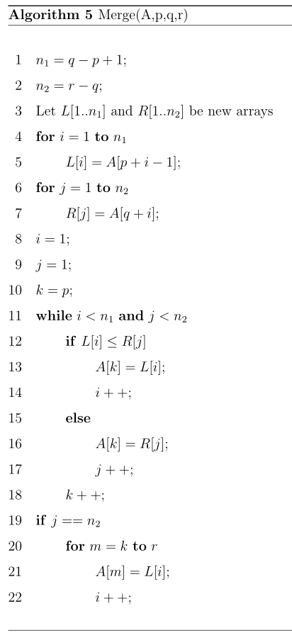

### Exercises 2.2-1
***
Using Figure 2.4 as a model, illustrate the operation of merge sort on the array A = <3, 41, 52, 26, 38, 57, 9, 49>.

### `Answer`

### Exercises 2.2-1
***
Rewrite the MERGE procedure so that it does not use sentinels, instead stopping
once either array L or R has had all its elements copied back to A and then copying
the remainder of the other array back into A.

### `Answer`
* Pseudo-code:

* Java-code:
[code](./MergeSort2.java)
